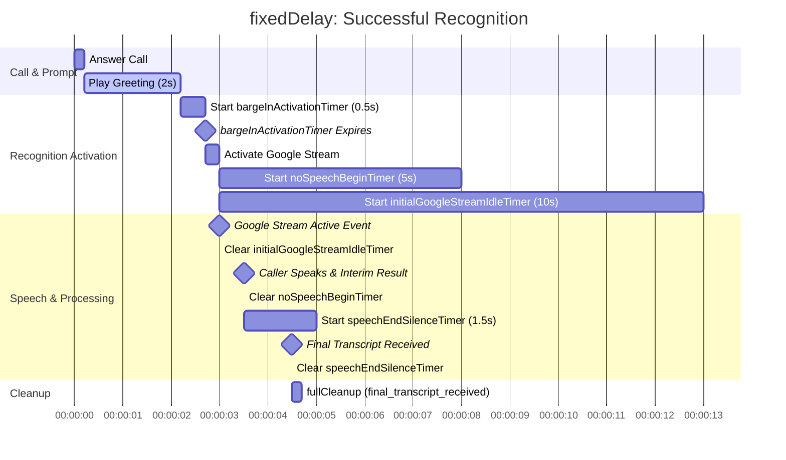
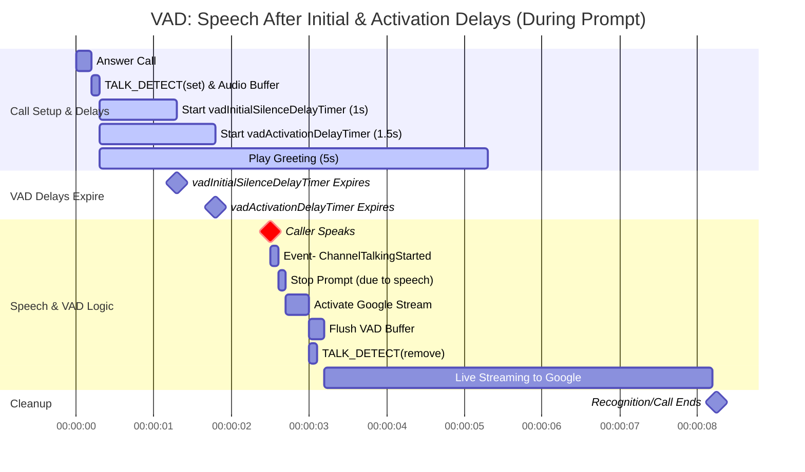
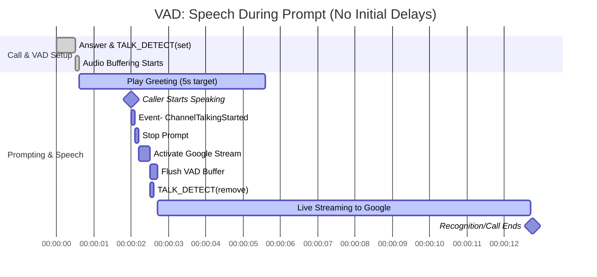
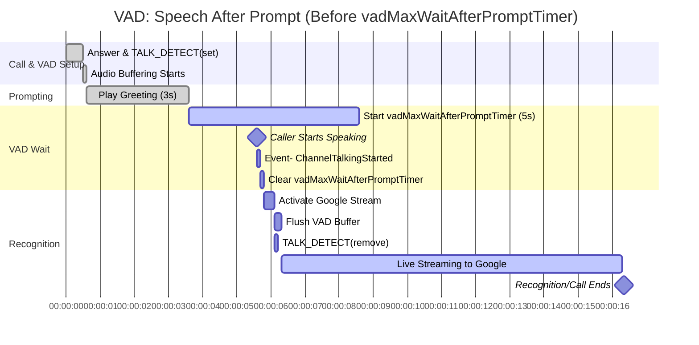
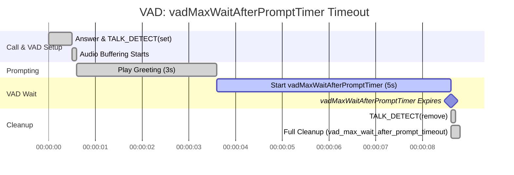
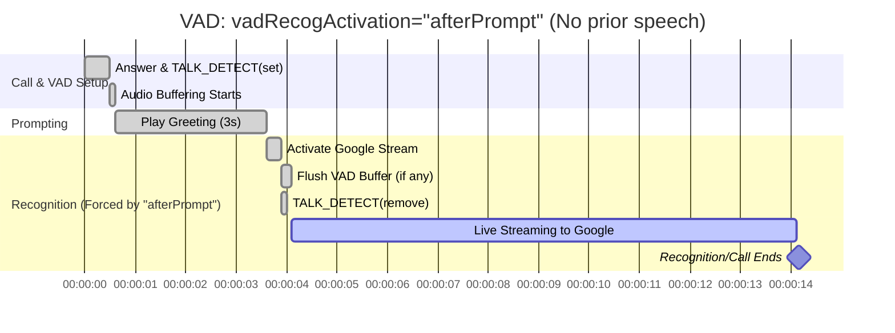
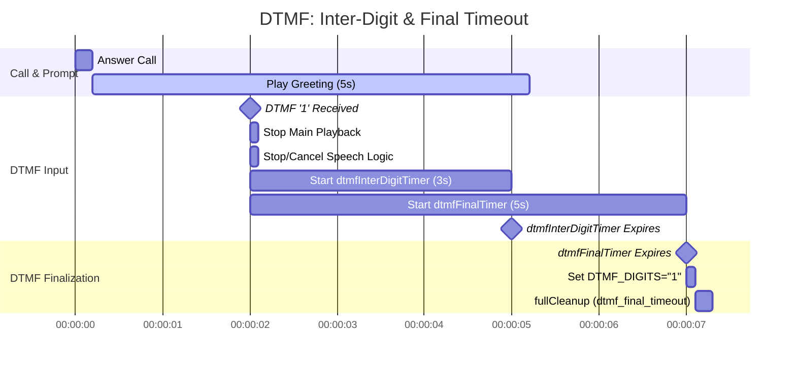

# Timeout Management in the ARI Speech-to-Text Application

## Introduction

Effective timeout management is crucial for voice applications to ensure responsiveness, manage costs, and provide a good user experience. This application utilizes a combination of application-level timers (defined in `appRecognitionConfig` and `dtmfConfig`) and Google Cloud Speech-to-Text VAD (Voice Activity Detection) level timers (defined in `googleSpeech.voiceActivityTimeout` when enabled). Understanding their interaction is key to configuring the system optimally.

Refer to `docs/variables.md` for details on how to configure these variables via `config/default.json`, environment variables, or Asterisk dialplan variables.

## Types of Timeouts

There are three main categories of timeouts:

### 1. Application-Level Speech Recognition Timeouts

These timeouts are managed by the Node.js application itself and are configured via `appRecognitionConfig` settings. They control the application's patience for various stages of the speech recognition process.

*   **`bargeInDelaySeconds`**
    *   **Purpose:** Used when `recognitionActivationMode` is `"fixedDelay"`. This timer delays the activation of the Google Speech stream after the initial prompt playback finishes (or is interrupted by VAD if VAD is also active and detects speech during the prompt). Its goal is to allow a brief moment for the caller to begin speaking after the prompt ends before streaming to Google starts. If set to 0, recognition starts immediately after the prompt (similar to `"immediate"` mode but still allowing for VAD interruption during the prompt).
    *   **Configuration:** `appRecognitionConfig.bargeInDelaySeconds`
    *   **Default:** `0.2` seconds
    *   **Starts:** After the initial greeting/prompt playback finishes or is stopped (e.g., by interim speech results or VAD during prompt).
    *   **Cleared If:** Call ends, or if VAD activates recognition before this timer expires.
    *   **Action on Expiration:** Activates Google Speech streaming via `activateGoogleStreamingAndRecognitionLogic(true)`.

*   **`noSpeechBeginTimeoutSeconds`**
    *   **Purpose:** Maximum time the application waits for Google to send a `SPEECH_ACTIVITY_BEGIN` event or an interim transcript after the Google Speech stream has been activated. This timer starts when `activateGoogleStreamingAndRecognitionLogic` successfully creates and starts the `speechStream`.
    *   **Configuration:** `appRecognitionConfig.noSpeechBeginTimeoutSeconds`
    *   **Default:** `5.0` seconds
    *   **Starts:** When the Google Speech stream is successfully initiated.
    *   **Cleared If:** `speechHasBegun` flag becomes true (due to `SPEECH_ACTIVITY_BEGIN` or an interim result), or if `fullCleanup` is called.
    *   **Action on Timeout:** Calls `fullCleanup(true, "app_no_speech_begin_timeout")`, which hangs up the call and may trigger fallback batch transcription. Sets `NO_SPEECH_BEGIN_TIMEOUT=true` channel variable.

*   **`initialGoogleStreamIdleTimeoutSeconds`**
    *   **Purpose:** Maximum time the application waits for the Google Cloud Speech-to-Text stream to become responsive (i.e., emit any data, typically an initial configuration response or speech event) after it's first initiated. This is a safeguard against scenarios where the stream connection might stall.
    *   **Configuration:** `appRecognitionConfig.initialGoogleStreamIdleTimeoutSeconds`
    *   **Default:** `10.0` seconds
    *   **Starts:** When the Google Speech stream is successfully initiated.
    *   **Cleared If:** Any data is received from the Google stream (specifically, when the `speechStream` 'data' event fires, which includes `SPEECH_ACTIVITY_BEGIN` or transcription results), or if `fullCleanup` is called.
    *   **Action on Timeout:** Calls `fullCleanup(true, "app_initial_google_stream_idle_timeout")`, hanging up the call and potentially triggering fallback. Sets `INITIAL_STREAM_IDLE_TIMEOUT=true` channel variable.

*   **`speechEndSilenceTimeoutSeconds`**
    *   **Purpose:** This application-level timer defines the maximum duration the application will wait for a *final* transcription result from Google. It is typically started/restarted in two main situations:
        1.  After Google sends a `SPEECH_ACTIVITY_END` event (if `enableVoiceActivityEvents` is true).
        2.  After an interim transcript is received and the application is waiting for a potential final result (especially if the app itself manages stream ending based on silence after interims).
    *   **Configuration:** `appRecognitionConfig.speechEndSilenceTimeoutSeconds`
    *   **Default:** `1.5` seconds
    *   **Starts/Resets:** On receiving an interim transcript or a `SPEECH_ACTIVITY_END` event from Google.
    *   **Cleared If:** A final transcript is received, or `fullCleanup` is called.
    *   **Action on Timeout:**
        *   If an interim transcript was received: The application may try to gracefully end the Google stream and then waits a further brief period (another instance of this timeout) for Google to return a final result. If that also times out, it calls `fullCleanup(false, "app_google_no_final_result_timeout_interim")`.
        *   If triggered after `SPEECH_ACTIVITY_END`: Calls `fullCleanup(false, "app_silence_after_google_speech_activity_end")`.
        *   In both cases, `false` for hangup means the call might continue to the dialplan with the last available transcript.

*   **`maxRecognitionDurationSeconds`**
    *   **Purpose:** An absolute maximum duration for the entire speech recognition attempt for a single Stasis call, from the point recognition is first activated. It acts as a hard limit.
    *   **Configuration:** `appRecognitionConfig.maxRecognitionDurationSeconds`
    *   **Default:** `30.0` seconds
    *   **Starts:** When `activateGoogleStreamingAndRecognitionLogic` is first called.
    *   **Cleared If:** `fullCleanup` is called for any reason.
    *   **Action on Timeout:** Calls `fullCleanup(true, "max_duration_timeout")`, hanging up the call.

### 2. VAD-Specific Application Timers
These timers are managed by the application when `appRecognitionConfig.recognitionActivationMode` is set to `"vad"`.

*   **`vadInitialSilenceDelaySeconds`**
    *   **Purpose:** Delays the VAD logic's responsiveness at the very start of a call. This allows for initial call setup sounds or brief silences from the caller without prematurely triggering VAD decisions or other no-speech timeouts. Audio is buffered by the application during this delay if VAD mode is active.
    *   **Configuration:** `appRecognitionConfig.vadInitialSilenceDelaySeconds`
    *   **Default:** `0.0` seconds (no delay)
    *   **Starts:** When the Stasis application begins processing an incoming call and VAD mode is configured (`recognitionActivationMode="vad"` and `vadRecogActivation="vadMode"`).
    *   **Cleared If:** `fullCleanup` is called.
    *   **On Expiration:** The `vadInitialSilenceDelayCompleted` flag is set to `true`. This allows other VAD logic (like processing `ChannelTalkingStarted` events or the `vadMaxWaitAfterPromptTimer`) to proceed, provided `vadActivationDelayCompleted` is also true.

*   **`vadActivationDelaySeconds`**:
    *   **Purpose**: If greater than 0, this timer introduces an additional general delay *after the call starts* before the application will fully react to VAD events (like `ChannelTalkingStarted`) or execute post-prompt VAD logic (like `vadRecogActivation="afterPrompt"` or starting `vadMaxWaitAfterPromptTimer`). Audio is buffered during this delay.
    *   **Configuration**: `appRecognitionConfig.vadActivationDelaySeconds`
    *   **Default:** `0.0` seconds (no delay)
    *   **Starts**: When the Stasis application begins processing an incoming call and VAD mode is configured (`recognitionActivationMode="vad"` and `vadRecogActivation="vadMode"`).
    *   **Cleared If**: `fullCleanup` is called.
    *   **On Expiration**: The `vadActivationDelayCompleted` flag becomes true. VAD logic can proceed if `vadInitialSilenceDelayCompleted` is also true. If `ChannelTalkingStarted` occurred or the prompt finished *during* this delay, their respective logic is now unblocked (if `vadInitialSilenceDelayCompleted` is also true).
    *   **Interaction:** Both `vadInitialSilenceDelayTimer` and `vadActivationDelayTimer` must expire (i.e., `vadInitialSilenceDelayCompleted` and `vadActivationDelayCompleted` must both be true) before VAD logic becomes fully responsive to speech events or proceeds with post-prompt actions like `vadMaxWaitAfterPromptTimer`.

*   **`vadMaxWaitAfterPromptTimer`**:
    *   **Purpose**: Used when `recognitionActivationMode` is `"vad"`, `vadRecogActivation` is `"vadMode"`, and both `vadInitialSilenceDelayCompleted` and `vadActivationDelayCompleted` are true. After an initial prompt finishes playing, if no speech has been detected yet (`ChannelTalkingStarted`), this timer defines how long the system will wait for speech to begin.
    *   **Configuration**: `appRecognitionConfig.vadMaxWaitAfterPromptSeconds`
    *   **Default:** `10.0` seconds
    *   **Starts**: After the initial prompt playback finishes, if no prior speech was detected and all other VAD delay conditions are met.
    *   **Cleared If**: A `ChannelTalkingStarted` event occurs, a DTMF digit is received, or `fullCleanup` is called.
    *   **Action on Expiration**: Calls `fullCleanup(false, "vad_max_wait_after_prompt_timeout")`. This may lead to fallback transcription. Google Speech streaming is not activated in this path. `TALK_DETECT(remove)` is attempted.

### 3. DTMF Timeouts
These timers manage the collection of DTMF (Dual-Tone Multi-Frequency) digits when `dtmfConfig.enableDtmfRecognition` is `true`.

*   **`dtmfInterDigitTimer`**:
    *   **Purpose:** Maximum time allowed between successive DTMF digits in a sequence.
    *   **Configuration:** `dtmfConfig.dtmfInterDigitTimeoutSeconds`
    *   **Default:** `3.0` seconds
    *   **Starts/Resets:** On receipt of each DTMF digit. If already running, it's cleared and restarted.
    *   **Cleared If:** `dtmfFinalTimer` expires or `fullCleanup` is called.
    *   **Action on Expiration:** This timer clearing itself implicitly means the system is now waiting for the `dtmfFinalTimeoutSeconds` to finalize the DTMF sequence. No direct action other than stopping this specific timer.

*   **`dtmfFinalTimer`**:
    *   **Purpose:** Time to wait after the last DTMF digit is received (or after an inter-digit timeout) before considering the complete DTMF input sequence as finalized.
    *   **Configuration:** `dtmfConfig.dtmfFinalTimeoutSeconds`
    *   **Default:** `5.0` seconds
    *   **Starts/Resets:** On receipt of any DTMF digit (after clearing any previous `dtmfInterDigitTimer` and `dtmfFinalTimer`).
    *   **Cleared If:** `fullCleanup` is called before this timer expires.
    *   **Action on Expiration:**
        1.  The collected DTMF digits (if any) are set to the `DTMF_DIGITS` channel variable.
        2.  Calls `fullCleanup(false, "dtmf_final_timeout")`, allowing the call to proceed to the dialplan with the collected DTMF. Speech recognition is typically bypassed/aborted when DTMF is received.

### 4. Google VAD Timeouts (Configured via API)

These timeouts are sent to Google as part of the `StreamingRecognitionConfig` if `googleSpeech.enableVoiceActivityTimeout` is `true`. They control Google's internal VAD.

*   **`speechStartTimeoutSeconds` (Google VAD)**
    *   **Purpose:** Instructs Google's VAD how long to wait for speech to begin *after its stream is active and processing audio*.
    *   **Configuration:** `googleSpeech.voiceActivityTimeout.speechStartTimeoutSeconds`
    *   **Default (App -> Google):** `10.0` seconds
    *   **Action on Timeout (by Google):** Google may send a `SPEECH_ACTIVITY_TIMEOUT` event or end the stream. The application reacts to this.

*   **`speechEndTimeoutSeconds` (Google VAD)**
    *   **Purpose:** Defines the duration of silence Google's VAD should observe *after speech stops* before considering the utterance complete.
    *   **Configuration:** `googleSpeech.voiceActivityTimeout.speechEndTimeoutSeconds`
    *   **Default (App -> Google):** `1.5` seconds
    *   **Action on Timeout (by Google):** Google finalizes the utterance and sends a transcript.

## Key Interaction Scenarios & Gantt Charts

Understanding how these timers interact is crucial. The `mermaid` Gantt charts below illustrate common sequences.

### Application-Level Recognition Activation & Timeouts

#### Scenario: `recognitionActivationMode="fixedDelay"` (No VAD involved post-prompt)


### VAD-Specific Timer Scenarios

#### Scenario: VAD with `vadInitialSilenceDelaySeconds` and `vadActivationDelaySeconds` (Speech *after* both delays, during prompt playback)

This scenario assumes `recognitionActivationMode="vad"` and `vadRecogActivation="vadMode"`.
*   `vadInitialSilenceDelaySeconds = 1.0s`
*   `vadActivationDelaySeconds = 1.5s`



#### Scenario: Caller speaks *during* prompt (VAD mode, no initial/activation delays or they are 0)



#### Scenario: Caller speaks *after* prompt, before `vadMaxWaitAfterPromptTimer` (VAD mode, `vadRecogActivation="vadMode"`)



#### Scenario: `vadMaxWaitAfterPromptTimer` expires (VAD mode, `vadRecogActivation="vadMode"`)



#### Scenario: Prompt ends, `vadRecogActivation="afterPrompt"` (VAD mode, no prior speech)



### DTMF Timer Scenarios

#### Scenario: Successful DTMF Entry

```mermaid
gantt
    dateFormat HH:mm:ss.SSS
    axisFormat %H:%M:%S
    title DTMF: Successful Entry

    section Call & Prompt
    Answer Call                     :s1, 00:00:00.000, 0.2s
    Play Greeting (5s)              :active, pg, after s1, 5s
    (Speech recognition might be active or pending based on mode)

    section DTMF Input
    DTMF '1' Received               :milestone, dt1, 00:00:02.000, 0s
    Stop Main Playback              :dsp, after dt1, 0.1s
    Stop/Cancel Speech Logic        :dsa, after dt1, 0.1s
    Start dtmfInterDigitTimer (3s)  :idt1, after dt1, 3s
    Start dtmfFinalTimer (5s)       :ft1, after dt1, 5s

    DTMF '2' Received               :milestone, dt2, 00:00:02.500, 0s
    Clear dtmfInterDigitTimer       :cidt1, after dt2, 0.05s
    Clear dtmfFinalTimer            :cft1, after dt2, 0.05s
    Start dtmfInterDigitTimer (3s)  :idt2, after cidt1, 3s
    Start dtmfFinalTimer (5s)       :ft2, after cft1, 5s

    DTMF '3' Received               :milestone, dt3, 00:00:03.000, 0s
    Clear dtmfInterDigitTimer       :cidt2, after dt3, 0.05s
    Clear dtmfFinalTimer            :cft2, after dt3, 0.05s
    Start dtmfInterDigitTimer (3s)  :idt3, after cidt2, 3s
    Start dtmfFinalTimer (5s)       :ft3, after cft2, 5s

    section DTMF Finalization
    dtmfFinalTimer Expires          :milestone, ft_exp, 00:00:08.000, 0s %% 3.0 + 5 = 8.0
    Clear dtmfInterDigitTimer       :cidt3, after ft_exp, 0.05s
    Set DTMF_DIGITS="123"           :svar, after ft_exp, 0.1s
    fullCleanup (dtmf_final_timeout):sclean, after svar, 0.2s
```

#### Scenario: DTMF Inter-Digit Timeout then Final Timeout



#### Scenario: DTMF Interrupting Active Speech Recognition

```mermaid
gantt
    dateFormat HH:mm:ss.SSS
    axisFormat %H:%M:%S
    title DTMF: Interrupts Speech Recognition

    section Call, Prompt & Speech Activation
    Answer Call                     :s1, 00:00:00.000, 0.2s
    Play Greeting (2s)              :pg, after s1, 2s
    Activate Google Stream          :ags, after pg, 0.3s
    Live Streaming to Google        :gs, after ags, 10s %% Assuming speech started

    section DTMF Input
    DTMF '1' Received               :milestone, dt1, 00:00:03.000, 0s
    Stop Main Playback (if playing) :dsp, after dt1, 0.1s
    Stop Google Stream              :sgs, after dt1, 0.1s
    (isVADBufferingActive=false, speechRecognitionDisabledDueToDtmf=true)
    Cleanup Speech Timers           :cst, after dt1, 0.1s
    Start dtmfInterDigitTimer (3s)  :idt1, after dt1, 3s
    Start dtmfFinalTimer (5s)       :ft1, after dt1, 5s

    section DTMF Finalization
    dtmfFinalTimer Expires          :milestone, ft_exp, 00:00:08.000, 0s %% 3.0 + 5 = 8.0
    Set DTMF_DIGITS="1"             :svar, after ft_exp, 0.1s
    fullCleanup (dtmf_final_timeout):sclean, after svar, 0.2s
```
[end of docs/timeout-management.md]
