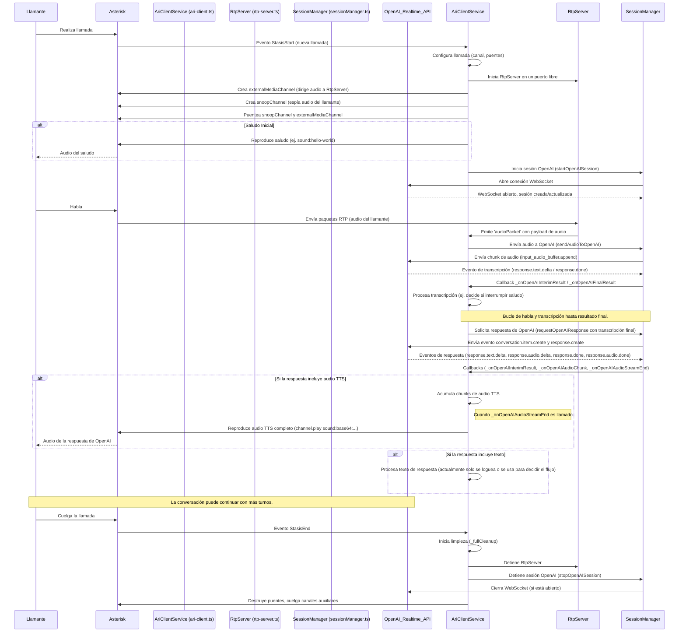

# Documento de Arquitectura: websocket-server

Este documento describe la arquitectura del `websocket-server`, una aplicación Node.js diseñada para integrar un sistema de telefonía Asterisk con la API Realtime de OpenAI para crear un asistente de voz interactivo.

## Componentes Principales

El sistema se compone de los siguientes módulos principales:

1.  **Cliente ARI (Asterisk Rest Interface) (`src/ari-client.ts`)**:
    *   **Responsabilidad**: Interactuar con Asterisk para gestionar el ciclo de vida de las llamadas, controlar los canales y puentes, y reproducir audio.
    *   **Funcionamiento**: Se conecta al servidor ARI de Asterisk y escucha eventos de inicio de llamada (`StasisStart`). Para cada llamada, configura los recursos necesarios (canales, puentes, snoop para captura de audio). Maneja la lógica de la aplicación Stasis, incluyendo la reproducción de saludos, la recepción de DTMF, y la finalización de la llamada. Es el orquestador principal del lado de la telefonía.

2.  **Servidor RTP (`src/rtp-server.ts`)**:
    *   **Responsabilidad**: Recibir el flujo de audio RTP del llamante desde Asterisk.
    *   **Funcionamiento**: Crea un servidor UDP que escucha en un puerto específico. Asterisk (a través de un canal `externalMedia`) envía paquetes RTP a este servidor. El `RtpServer` extrae el payload de audio (generalmente G.711 ulaw) de estos paquetes y lo emite para que otros módulos (principalmente `AriClientService`) lo procesen y envíen a OpenAI para reconocimiento de voz.

3.  **Gestor de Sesiones de OpenAI (`src/sessionManager.ts`)**:
    *   **Responsabilidad**: Gestionar la comunicación WebSocket con la API Realtime de OpenAI.
    *   **Funcionamiento**: Establece una conexión WebSocket segura con OpenAI. Envía el audio del llamante (recibido a través del `RtpServer` y `AriClientService`) a OpenAI para transcripción en tiempo real. Envía solicitudes de respuesta a OpenAI basadas en la transcripción final. Recibe eventos de OpenAI, incluyendo transcripciones parciales y finales, chunks de audio TTS (Text-to-Speech) y errores. Proporciona callbacks al `AriClientService` para manejar estos eventos.

4.  **API Realtime de OpenAI (Servicio Externo)**:
    *   **Responsabilidad**: Proporcionar transcripción de voz a texto en tiempo real, generación de respuestas por un modelo de lenguaje y síntesis de voz a texto en tiempo real.
    *   **Funcionamiento**: Recibe audio del llamante, lo transcribe, procesa la transcripción con un modelo de IA (ej. GPT-4o mini realtime) para generar una respuesta, y opcionalmente sintetiza esta respuesta en audio. Todo esto ocurre a través de una conexión WebSocket gestionada por `sessionManager.ts`.

## Flujo de una Llamada Típica

## Interacción de Componentes Clave

*   **`AriClientService` como Orquestador**: Es el componente central que reacciona a los eventos de Asterisk y coordina las acciones de los otros módulos. Decide cuándo iniciar/detener el `RtpServer`, cuándo iniciar/detener una sesión con OpenAI a través del `SessionManager`, y cuándo reproducir audio en el canal del llamante.
*   **Flujo de Audio del Llamante**: `Llamante -> Asterisk (snoopChannel) -> Asterisk (externalMediaChannel) -> RtpServer -> AriClientService -> SessionManager -> OpenAI`.
*   **Flujo de Audio de OpenAI (TTS)**: `OpenAI -> SessionManager -> AriClientService -> Asterisk (channel.play) -> Llamante`.
*   **Configuración**: La configuración se carga desde `config/default.json` y puede ser sobrescrita por variables de entorno. `AriClientService` es responsable de obtener la configuración específica para cada llamada.

## Consideraciones de Diseño

*   **Modularidad**: Cada componente tiene responsabilidades bien definidas, lo que facilita el mantenimiento y la extensión.
*   **Tiempo Real**: El uso de WebSockets para la API de OpenAI y RTP para el audio de Asterisk está orientado a una baja latencia para permitir una conversación natural.
*   **Manejo de Errores y Limpieza**: Se implementa lógica para limpiar recursos (puentes, canales, servidores, sesiones WebSocket) al finalizar una llamada o en caso de error.
*   **Configurabilidad**: Muchos aspectos del comportamiento de la aplicación, como los timeouts, los formatos de audio y las instrucciones para OpenAI, son configurables.
*   **Logging**: Se utiliza un sistema de logging para rastrear el flujo de la llamada y diagnosticar problemas. Se pueden configurar diferentes niveles de log.

Este diseño busca proporcionar una base robusta para construir aplicaciones de voz interactivas complejas.
Ahora crearé `websocket-server/docs/file-explanation.md`.
