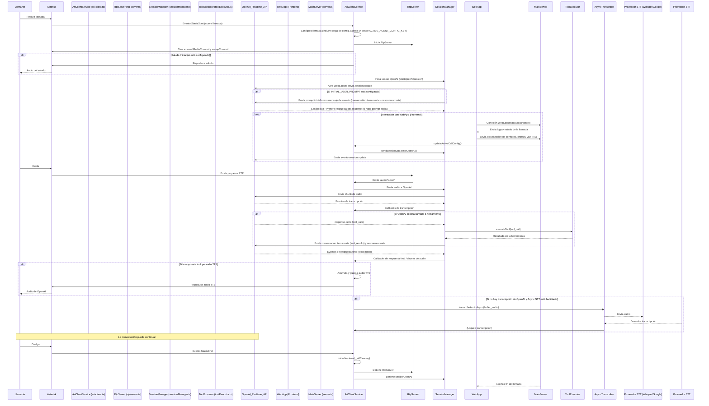

# Documento de Arquitectura: websocket-server

Este documento describe la arquitectura del `websocket-server`, una aplicación Node.js diseñada para integrar un sistema de telefonía Asterisk con la API Realtime de OpenAI para crear un asistente de voz interactivo.

## Componentes Principales

El sistema se compone de los siguientes módulos principales:

1.  **Cliente ARI (Asterisk Rest Interface) (`src/ari-client.ts`)**:
    *   **Responsabilidad**: Interactuar con Asterisk para gestionar el ciclo de vida de las llamadas, controlar los canales y puentes, y reproducir audio. Carga la configuración específica de la llamada, incluyendo el escenario del agente de IA (instrucciones y herramientas) basado en variables de entorno.
    *   **Funcionamiento**: Se conecta al servidor ARI de Asterisk y escucha eventos de inicio de llamada (`StasisStart`). Para cada llamada, configura los recursos necesarios (canales, puentes, snoop para captura de audio). Maneja la lógica de la aplicación Stasis, incluyendo la reproducción de saludos, la recepción de DTMF, y la finalización de la llamada. Es el orquestador principal del lado de la telefonía.

2.  **Servidor RTP (`src/rtp-server.ts`)**:
    *   **Responsabilidad**: Recibir el flujo de audio RTP del llamante desde Asterisk.
    *   **Funcionamiento**: Crea un servidor UDP que escucha en un puerto específico. Asterisk (a través de un canal `externalMedia`) envía paquetes RTP a este servidor. El `RtpServer` extrae el payload de audio (generalmente G.711 ulaw) de estos paquetes y lo emite para que otros módulos (principalmente `AriClientService`) lo procesen y envíen a OpenAI para reconocimiento de voz.

3.  **Gestor de Sesiones de OpenAI (`src/sessionManager.ts`)**:
    *   **Responsabilidad**: Gestionar la comunicación WebSocket con la API Realtime de OpenAI.
    *   **Funcionamiento**: Establece una conexión WebSocket segura con OpenAI. Envía el audio del llamante (recibido a través del `RtpServer` y `AriClientService`) a OpenAI para transcripción en tiempo real. Envía solicitudes de respuesta a OpenAI basadas en la transcripción final. Recibe eventos de OpenAI, incluyendo transcripciones parciales y finales, chunks de audio TTS (Text-to-Speech), solicitudes de llamadas a herramientas y errores. Proporciona callbacks al `AriClientService` para manejar estos eventos. Si se configura `INITIAL_USER_PROMPT`, envía este mensaje inicial para que el asistente hable primero.

4.  **Ejecutor de Herramientas (`src/toolExecutor.ts`)**:
    *   **Responsabilidad**: Ejecutar las funciones (herramientas) solicitadas por el modelo de OpenAI.
    *   **Funcionamiento**: Recibe una solicitud de llamada a herramienta desde `SessionManager` (originada por OpenAI). Parsea los argumentos y ejecuta la lógica de la herramienta correspondiente. Devuelve el resultado de la ejecución de la herramienta. Actualmente, implementa varias herramientas con lógica simulada/mock.

5.  **Transcriptor Asíncrono (`src/async-transcriber.ts`)**:
    *   **Responsabilidad**: Proporcionar una transcripción de respaldo si la API Realtime de OpenAI no devuelve una transcripción para el turno del hablante.
    *   **Funcionamiento**: Si está habilitado, y después de que un turno de habla del usuario finaliza sin una transcripción de OpenAI, `AriClientService` puede invocar `transcribeAudioAsync`. Esta función toma el buffer de audio acumulado para ese turno y lo envía a un proveedor de STT secundario (OpenAI Whisper API o Google Speech-to-Text V1). La transcripción resultante se registra.

6.  **API Realtime de OpenAI (Servicio Externo)**:
    *   **Responsabilidad**: Proporcionar transcripción de voz a texto en tiempo real, generación de respuestas por un modelo de lenguaje (incluyendo la decisión de llamar a herramientas) y síntesis de voz a texto en tiempo real.
    *   **Funcionamiento**: Recibe audio del llamante, lo transcribe, procesa la transcripción con un modelo de IA para generar una respuesta (que puede incluir la solicitud de ejecutar una herramienta), y opcionalmente sintetiza esta respuesta en audio. Todo esto ocurre a través de una conexión WebSocket gestionada por `sessionManager.ts`.

## Flujo de una Llamada Típica

## Interacción de Componentes Clave

*   **`AriClientService` como Orquestador Telefónico**: Componente central que reacciona a eventos de Asterisk y coordina acciones. Carga la configuración del agente de IA (instrucciones, herramientas) al inicio de la llamada usando la variable `ACTIVE_AGENT_CONFIG_KEY`.
*   **`server.ts` como Orquestador de Conexiones Externas**: Maneja el servidor HTTP/WebSocket principal.
*   **Flujo de Audio del Llamante**: `Llamante -> Asterisk -> RtpServer -> AriClientService -> SessionManager -> OpenAI`.
*   **Flujo de Audio de OpenAI (TTS)**: `OpenAI -> SessionManager -> AriClientService -> (Guarda y reproduce vía Asterisk) -> Llamante`.
*   **Configuración**: La configuración general se carga desde `config/default.json` y puede ser sobrescrita por variables de entorno. La configuración específica del agente (instrucciones, herramientas) se carga desde `config/agentConfigs/` según `ACTIVE_AGENT_CONFIG_KEY`. La `webapp` puede modificar dinámicamente ciertos parámetros durante una llamada activa.
*   **Llamadas a Herramientas (Tool Calls)**: Cuando OpenAI determina que una herramienta debe ser llamada, envía un evento a `SessionManager`. `SessionManager` invoca a `toolExecutor.ts` para ejecutar la herramienta. `toolExecutor.ts` contiene la lógica (actualmente simulada) para diversas herramientas definidas en las configuraciones de los agentes. El resultado se devuelve a OpenAI para que pueda formular una respuesta basada en la salida de la herramienta.
*   **Transcripción Asíncrona (Async STT)**: Si la transcripción en tiempo real de OpenAI falla o no se proporciona, y si Async STT está habilitado, `AriClientService` pasa el audio del turno del usuario a `src/async-transcriber.ts`. Este módulo puede usar OpenAI Whisper API o Google Speech-to-Text V1 (requiere instalación del SDK de Google Cloud y configuración de credenciales) para obtener una transcripción. Esta transcripción se utiliza principalmente para logging y análisis post-llamada.

## Formatos de Audio y Procesamiento
(Esta sección permanece mayormente sin cambios, ya que los detalles del procesamiento de audio no fueron alterados significativamente por las tareas recientes, excepto por la mención del buffer para Async STT).

*   **Entrada (Llamante a IA):**
    *   Asterisk envía audio del llamante (usualmente G.711 µ-law) vía RTP.
    *   `RtpServer` captura estos datos.
    *   `AriClientService` bufferiza este audio por turno para posible uso por Async STT.
    *   OpenAI Realtime API se configura para aceptar un formato específico.
*   **Salida (IA a Llamante - TTS):**
    *   OpenAI Realtime API genera audio en el formato solicitado.
    *   Se guarda como archivo (`.wav`, `.ulaw`, etc.) y se reproduce mediante Asterisk.

## Consideraciones de Diseño

*   **Modularidad**: Cada componente tiene responsabilidades bien definidas.
*   **Tiempo Real**: Uso de WebSockets y RTP para baja latencia.
*   **Manejo de Errores y Limpieza**: Lógica para limpiar recursos.
*   **Configurabilidad**: Múltiples aspectos son configurables. La selección del agente de IA es ahora dinámica mediante `ACTIVE_AGENT_CONFIG_KEY`. Se ha añadido la opción de un mensaje inicial del sistema (`INITIAL_USER_PROMPT`) para que el asistente hable primero.
*   **Extensibilidad de Herramientas**: El sistema está diseñado para que se puedan añadir nuevas herramientas en `toolExecutor.ts` y definirlas en las configuraciones de los agentes. Para escenarios con un gran número de herramientas complejas, se podría considerar en el futuro un modelo de IA secundario (no Realtime) para ayudar al agente Realtime a seleccionar y parametrizar herramientas.
*   **Resiliencia en Transcripción**: La adición de Async STT con proveedores como OpenAI Whisper API y Google Speech-to-Text V1 ofrece un mecanismo de respaldo para la transcripción.
*   **Logging**: Sistema de logging para rastreo y diagnóstico.

Este diseño busca proporcionar una base robusta y flexible para construir aplicaciones de voz interactivas complejas.
