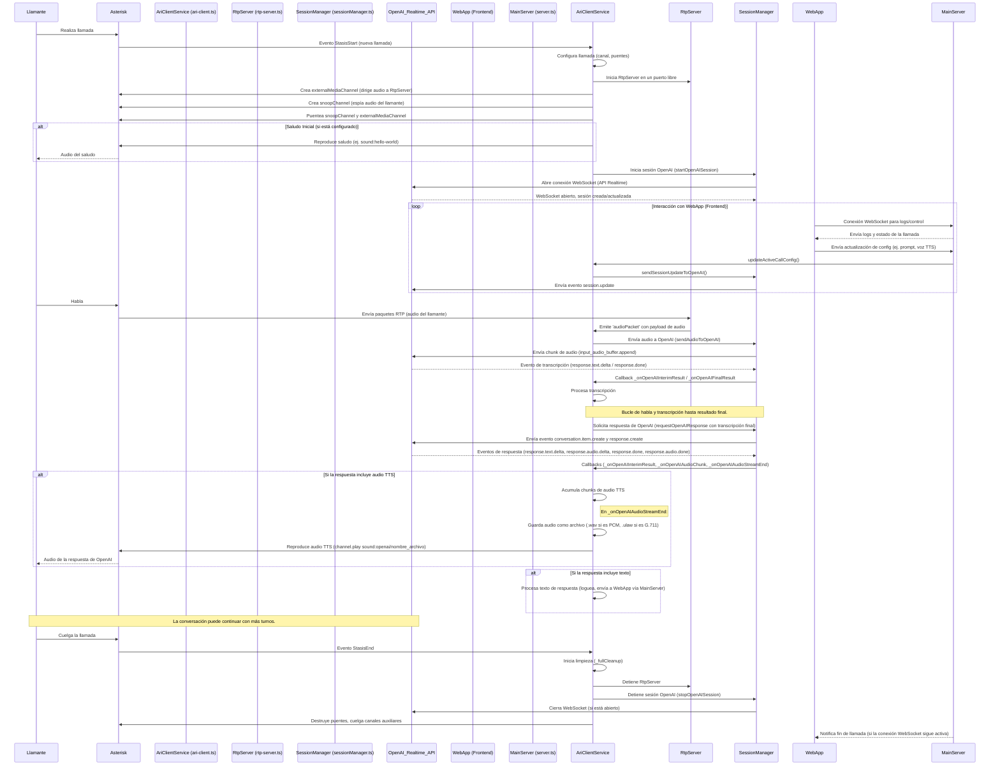

# Documento de Arquitectura: websocket-server

Este documento describe la arquitectura del `websocket-server`, una aplicación Node.js diseñada para integrar un sistema de telefonía Asterisk con la API Realtime de OpenAI para crear un asistente de voz interactivo.

## Componentes Principales

El sistema se compone de los siguientes módulos principales:

1.  **Cliente ARI (Asterisk Rest Interface) (`src/ari-client.ts`)**:
    *   **Responsabilidad**: Interactuar con Asterisk para gestionar el ciclo de vida de las llamadas, controlar los canales y puentes, y reproducir audio.
    *   **Funcionamiento**: Se conecta al servidor ARI de Asterisk y escucha eventos de inicio de llamada (`StasisStart`). Para cada llamada, configura los recursos necesarios (canales, puentes, snoop para captura de audio). Maneja la lógica de la aplicación Stasis, incluyendo la reproducción de saludos, la recepción de DTMF, y la finalización de la llamada. Es el orquestador principal del lado de la telefonía.

2.  **Servidor RTP (`src/rtp-server.ts`)**:
    *   **Responsabilidad**: Recibir el flujo de audio RTP del llamante desde Asterisk.
    *   **Funcionamiento**: Crea un servidor UDP que escucha en un puerto específico. Asterisk (a través de un canal `externalMedia`) envía paquetes RTP a este servidor. El `RtpServer` extrae el payload de audio (generalmente G.711 ulaw) de estos paquetes y lo emite para que otros módulos (principalmente `AriClientService`) lo procesen y envíen a OpenAI para reconocimiento de voz.

3.  **Gestor de Sesiones de OpenAI (`src/sessionManager.ts`)**:
    *   **Responsabilidad**: Gestionar la comunicación WebSocket con la API Realtime de OpenAI.
    *   **Funcionamiento**: Establece una conexión WebSocket segura con OpenAI. Envía el audio del llamante (recibido a través del `RtpServer` y `AriClientService`) a OpenAI para transcripción en tiempo real. Envía solicitudes de respuesta a OpenAI basadas en la transcripción final. Recibe eventos de OpenAI, incluyendo transcripciones parciales y finales, chunks de audio TTS (Text-to-Speech) y errores. Proporciona callbacks al `AriClientService` para manejar estos eventos.

4.  **API Realtime de OpenAI (Servicio Externo)**:
    *   **Responsabilidad**: Proporcionar transcripción de voz a texto en tiempo real, generación de respuestas por un modelo de lenguaje y síntesis de voz a texto en tiempo real.
    *   **Funcionamiento**: Recibe audio del llamante, lo transcribe, procesa la transcripción con un modelo de IA (ej. GPT-4o mini realtime) para generar una respuesta, y opcionalmente sintetiza esta respuesta en audio. Todo esto ocurre a través de una conexión WebSocket gestionada por `sessionManager.ts`.

## Flujo de una Llamada Típica

## Interacción de Componentes Clave

*   **`AriClientService` como Orquestador Telefónico**: Es el componente central que reacciona a los eventos de Asterisk y coordina las acciones de los otros módulos del backend relacionados con la llamada. Decide cuándo iniciar/detener el `RtpServer`, cuándo iniciar/detener una sesión con OpenAI a través del `SessionManager`, y cuándo reproducir audio en el canal del llamante. También recibe actualizaciones de configuración desde `server.ts`.
*   **`server.ts` como Orquestador de Conexiones Externas**: Maneja el servidor HTTP/WebSocket principal. Inicializa `AriClientService`. Expone el endpoint WebSocket para que la `webapp` se conecte, reciba logs/eventos y envíe comandos de configuración.
*   **Flujo de Audio del Llamante**: `Llamante -> Asterisk (snoopChannel) -> Asterisk (externalMediaChannel) -> RtpServer -> AriClientService -> SessionManager -> OpenAI`.
*   **Flujo de Audio de OpenAI (TTS)**: `OpenAI -> SessionManager -> AriClientService -> (Guarda como archivo .wav/.ulaw) -> Asterisk (channel.play) -> Llamante`.
*   **Configuración**: La configuración se carga desde `config/default.json` y puede ser sobrescrita por variables de entorno. `AriClientService` es responsable de obtener la configuración específica para cada llamada. La `webapp` puede modificar dinámicamente ciertos parámetros de la configuración de la llamada activa a través de `server.ts`.

## Formatos de Audio y Procesamiento

*   **Entrada (Llamante a IA):**
    *   Asterisk envía audio del llamante (usualmente G.711 µ-law) vía RTP.
    *   `RtpServer` captura estos datos.
    *   OpenAI Realtime API se configura (vía `sessionManager.ts` usando valores de `config`) para aceptar un formato específico, como `g711_ulaw` o `pcm_s16le_8000hz` (o `pcm_s16le_16000hz` etc.).
*   **Salida (IA a Llamante - TTS):**
    *   OpenAI Realtime API genera audio en el formato solicitado en la configuración de la sesión (`outputAudioFormat`), por ejemplo, `g711_ulaw` o `pcm_s16le_8000hz`/`pcm_s16le_16000hz`.
    *   **Procesamiento en `ari-client.ts` (`_onOpenAIAudioStreamEnd`):**
        *   Si el `outputAudioFormat` es un tipo **PCM** (ej. `pcm_s16le_XXXXhz`):
            *   El buffer de audio base64 recibido de OpenAI se decodifica.
            *   Se **genera un encabezado WAV estándar** para este audio PCM. La frecuencia de muestreo (`outputAudioSampleRate` de la config) y otros parámetros se escriben en el encabezado.
            *   El audio con su nuevo encabezado WAV se guarda como un archivo `.wav` en el directorio de sonidos de Asterisk (ej. `/var/lib/asterisk/sounds/openai/`).
        *   Si el `outputAudioFormat` es `g711_ulaw` (o `mulaw_8000hz`):
            *   El audio se guarda como un archivo `.ulaw` crudo.
        *   Otros formatos (MP3, Opus) se guardarían con sus extensiones respectivas.
    *   Asterisk reproduce estos archivos al llamante usando `channel.play({ media: 'sound:openai/nombre_archivo_sin_extension' })`.

## Consideraciones de Diseño

*   **Modularidad**: Cada componente tiene responsabilidades bien definidas.
*   **Tiempo Real**: Uso de WebSockets y RTP para baja latencia.
*   **Manejo de Errores y Limpieza**: Lógica para limpiar recursos al finalizar llamadas o en errores.
*   **Configurabilidad**: Múltiples aspectos son configurables (timeouts, formatos de audio, prompts de IA). La `webapp` permite la configuración dinámica de algunos de estos durante una llamada activa.
*   **Logging**: Sistema de logging para rastreo y diagnóstico.

Este diseño busca proporcionar una base robusta para construir aplicaciones de voz interactivas complejas, con capacidad de monitoreo y control externo.
Ahora crearé `websocket-server/docs/file-explanation.md`.
